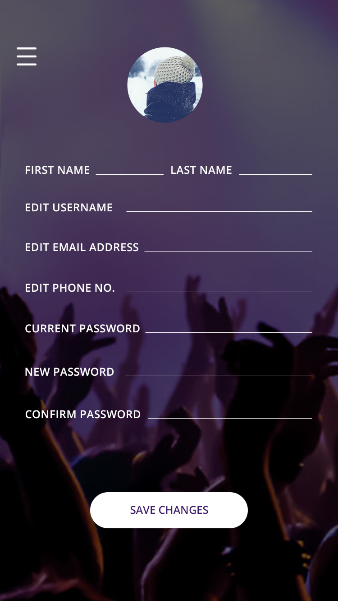

 # Pixme Platform

PIXME is a social network for events, connecting participants and photographers to easily share and experience event photos together, fostering a sense of community and enriching the event experience for everyone involved.  

#### The project includes:
#### ***Android App***
The Android App is developed using Xamarin (C#) and is intended for standard participants. It allows them to connect and easily share event photos within the PIXME social network.

#### ***Windows App*** 
The Windows App is designed for professional photographers. It enables them to efficiently share the photos they captured during the events.    

## Skills
* Xamarin (Cross platform)
* Wndows Applications
* RDS - **(AWS)**
* Sql Server
* WCF
* C#
# About
I had the opportunity to participate in "MAX" accelerator
program.

	  
  
  
  

## Screenshots
<table>
  <tr>
    <td>
      
    </td>
    <td>
      
    </td>
    <td>
      
    </td>
			
  </tr>
  <tr>
    <td>
      
    </td>
    <td>
      
    </td>
  </tr>
</table>

## Feedback
If you have any feedback, feel free to contact [me](https://github.com/yarintabashi) at yarintabashi@gmail.com or visit the "issues" section for further assistance.
